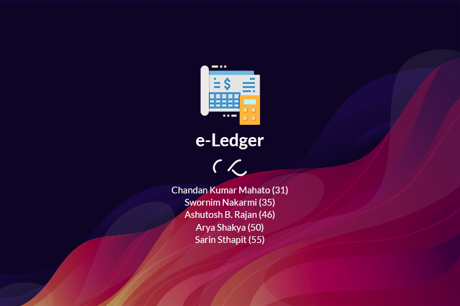
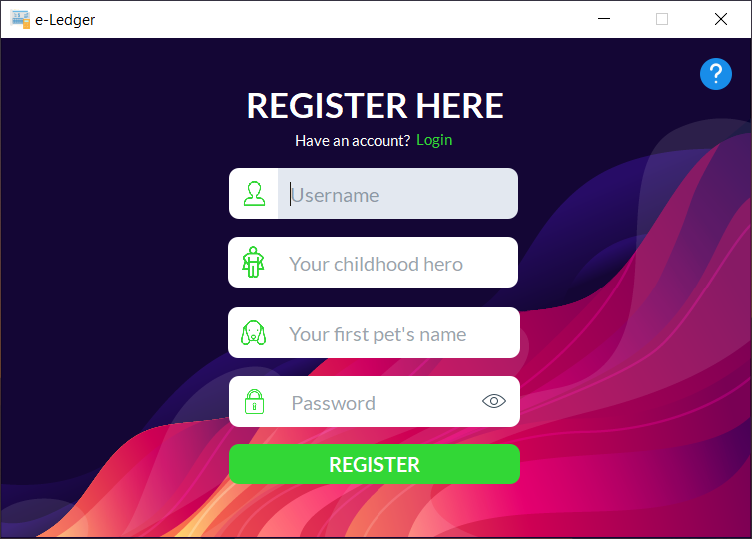
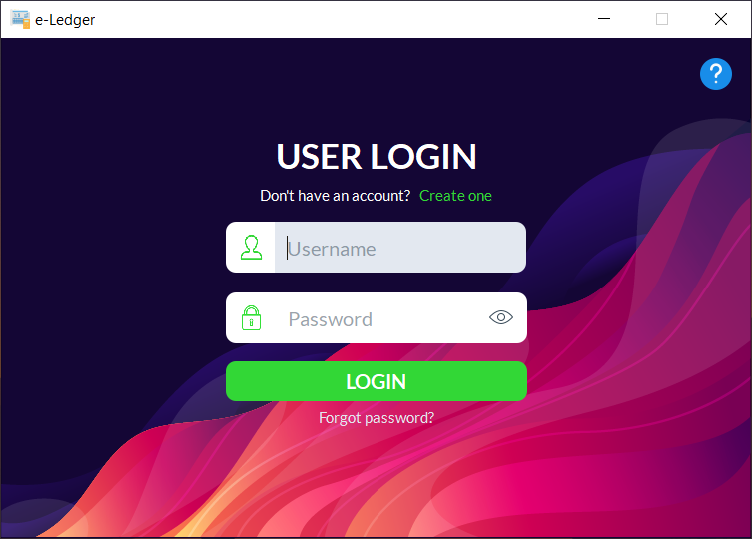
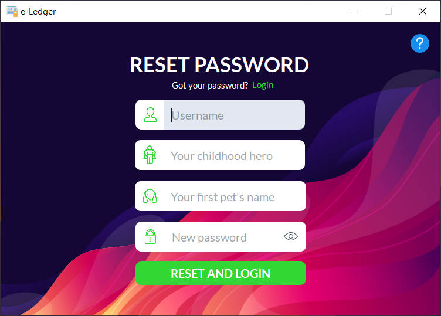
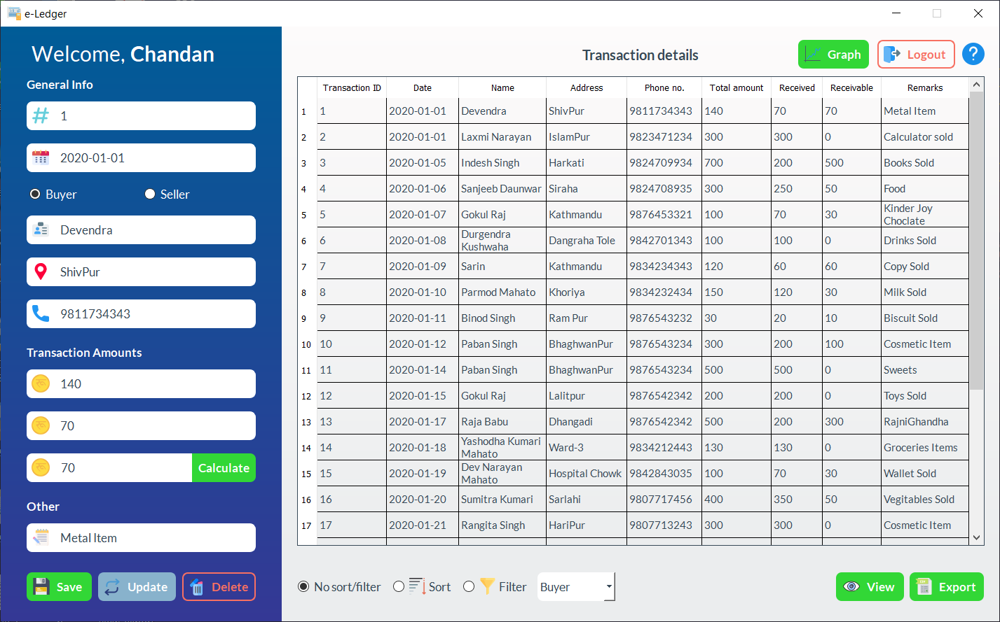
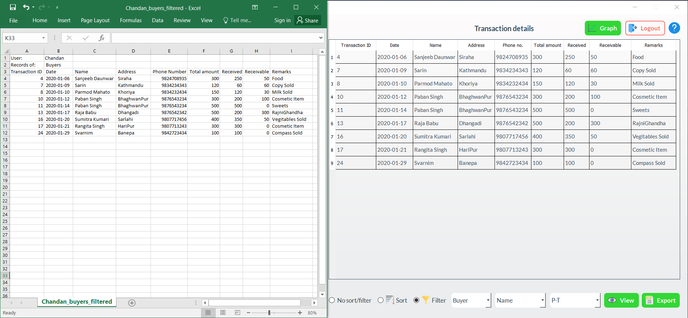
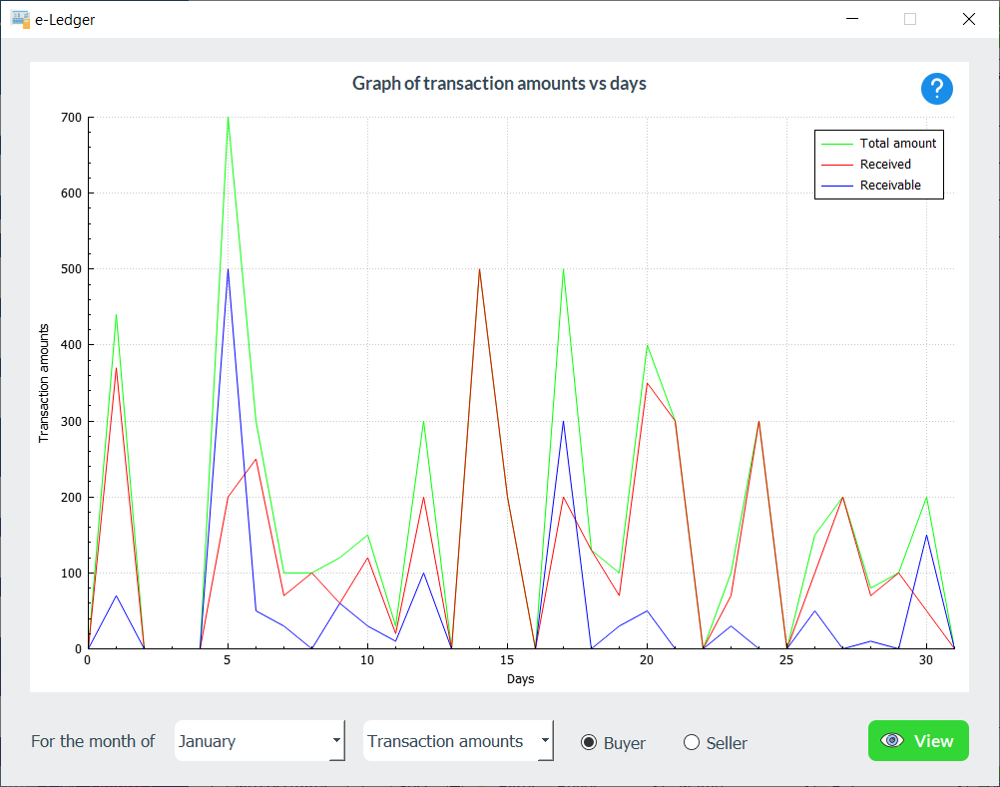
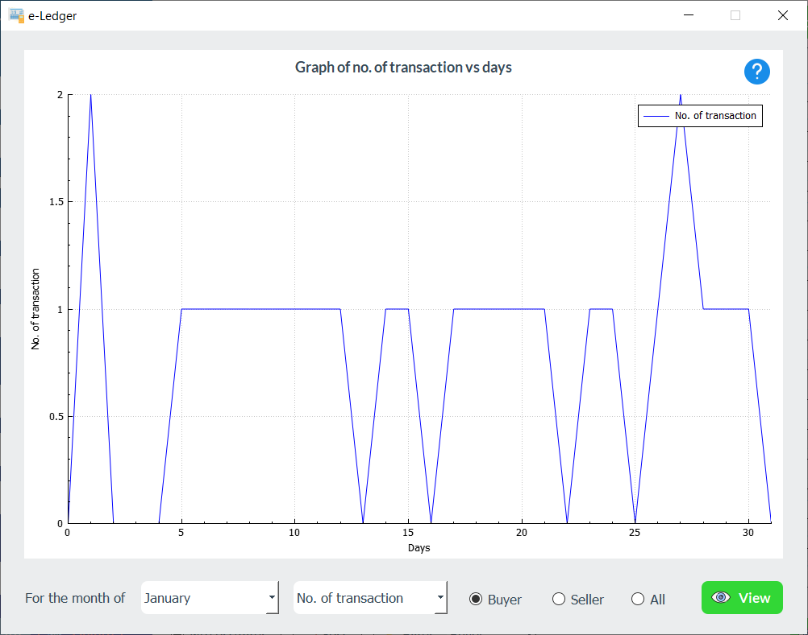
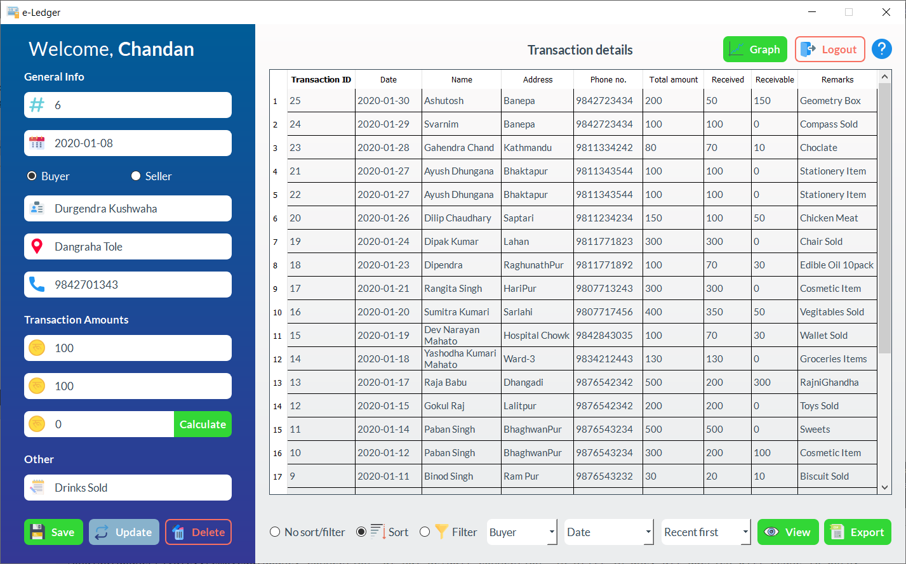
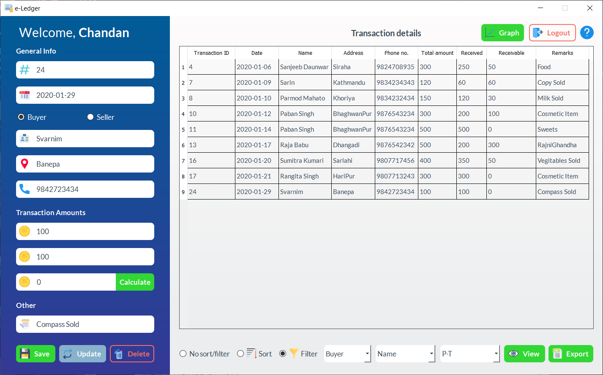

# e-Ledger
This is our academic project. 📚📖🧾💻
The project was done for the fulfillment of ENGG 102 (2nd Semester Project).
## Adding GUI support.

#### Project Title: e-Ledger

#### Group members:
    1. Chandan Kumar Mahato
    2. Swornim Nakarmi
    3. Ashutosh B. Rajan
    4. Arya Shakya
    5. Sarin Sthapit
  
 ### What have we used?
   * [C++](https://cppreference.com "C++ Reference")
   * [Qt](https://www.qt.io "Visit Qt homepage")
   * [SQLite](https://sqlite.org/index.html "Visit SQLite homepage")

> **This GitHub team was created on August 1, 2020.**

## Screenshots:

*Disclaimer*